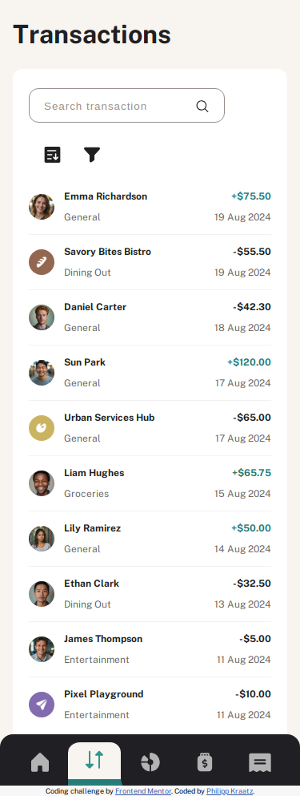
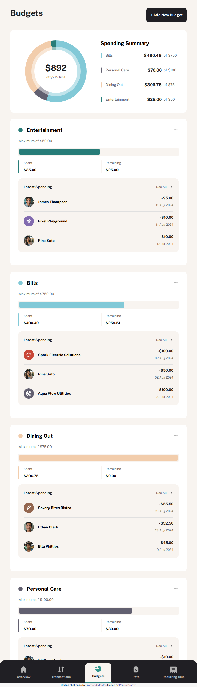
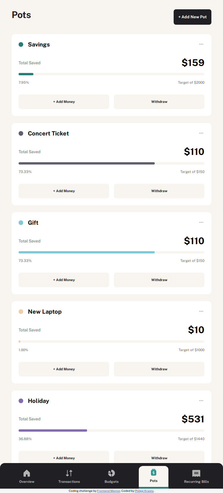
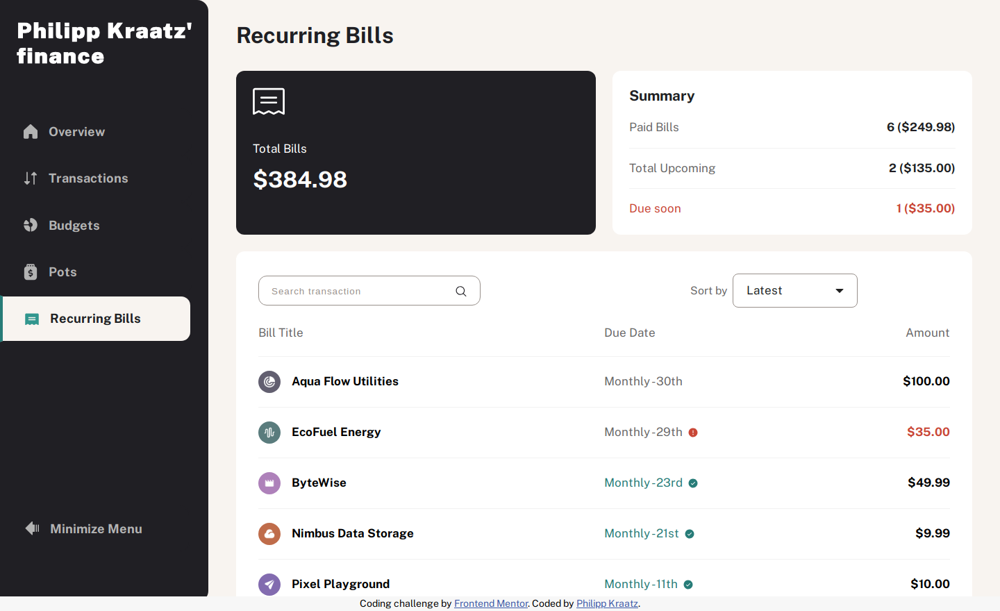

# Philipp Kraatz' finance - Personal Finance App

This is a solution to the [Personal finance app challenge on Frontend Mentor](https://www.frontendmentor.io/challenges/personal-finance-app-JfjtZgyMt1). Frontend Mentor provides challenges to build realistic projects.

## Table of contents

- [Overview](#overview)
    - [Screenshots - OverviewPage](#screenshots---overviewpage)
    - [Screenshots - TransactionsPage](#screenshots---transactionspage)
    - [Screenshots - BudgetsPage](#screenshots---budgetspage)
    - [Screenshots - PotsPage](#screenshots---potspage)
    - [Screenshots - BillsPage](#screenshots---billspage)
    - [Links](#links)
- [My process](#my-process)
    - [Built with](#built-with)
    - [What I learned](#what-i-learned)
    - [Continued development](#continued-development)
    - [Useful resources](#useful-resources)
- [Author](#author)
- [Acknowledgments](#acknowledgments)

## Overview

### Screenshots - OverviewPage

Desktop

Tablet

Mobile

### Screenshots - TransactionsPage

Desktop

Tablet

Mobile

### Screenshots - BudgetsPage

Desktop

Tablet

Mobile

### Screenshots - PotsPage

Desktop

Tablet

Mobile

### Screenshots - BillsPage

Desktop

Tablet

Mobile

### Links

- Solution URL: [Add solution URL here](https://github.com/kephalosk/personal-finance-app)
- Live Site URL: [Add live site URL here](https://philippkraatz.com)

## My process

1. download Project

2. move Project to target folder

3. open Project in IDE

4. read README

5. add .gitignore-file

6. check files

7. check design

8. initialize repo
* create repo on GitHub
* git init
* git add .
* git commit -m "initial commit"
* git remote add origin git@github.com:kephalosk/${projectname}.git
* git push -u origin master

9. check html
* build general structure
* open index.html in browser for comparison

10. check css
* 1. margin
* 2. border
* 3. background
* 4. padding
* 5. height/width
* 6. display
* 7. font styling
* 8. image styling
* 9. color styling

11. check transitions

12. check javascript

13. check mobile/responsive design

14. check accessability
* semantic html
* headings
* alternative texts
* language
* clear language
* link texts
* keyboard control / tabindex
* img aria-hidden: true for decorative images

15. extract css

16. add screenshots

17. update README

18. publish website

### Built with

Frontend
- React + Vite
- HTML5 markup
- SCSS custom properties
- Jest
- Playwright
- Desktop-first workflow

Backend
- Nest.js
- TypeORM
- PostgreSQL
- Jest

Deployment
- Docker
- Kubernetes
- GitHub Actions
- CI/CD Pipeline

### What I learned

Building a responsive web application with React.

### Continued development

* improve html
* improve css

### Useful resources

- [w3schools](https://www.w3schools.com/) - HTML and CSS knowledge
- [selfhtml](https://wiki.selfhtml.org/wiki/HTML) - HTML knowledge

## Author

- Website - [Philipp Kraatz](https://philippkraatz.com)
- Frontend Mentor - [@yourusername](https://www.frontendmentor.io/profile/yourusername)

## Acknowledgments

None.