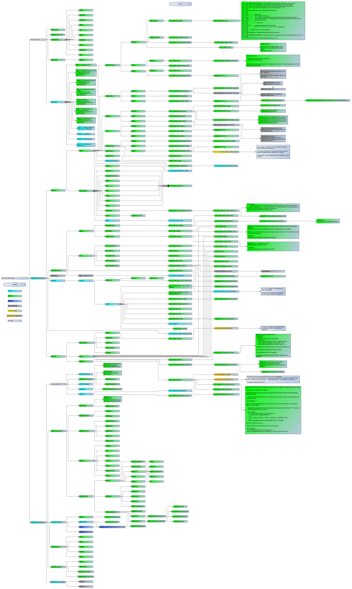
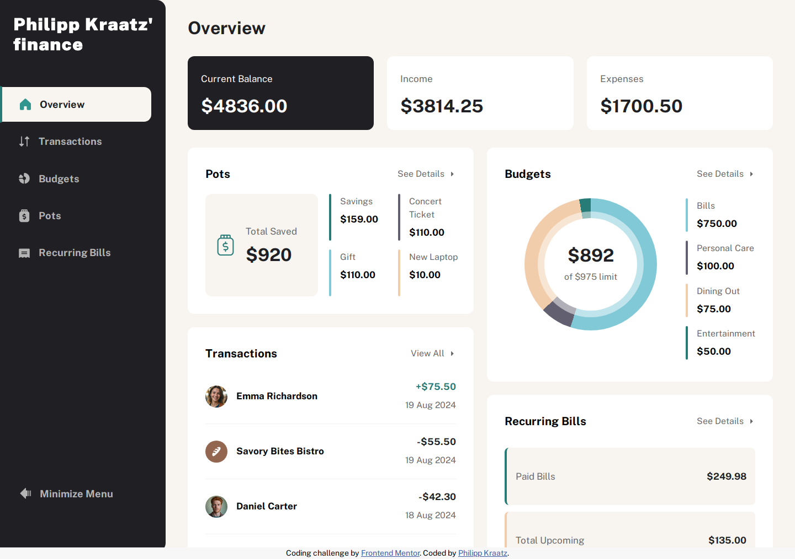
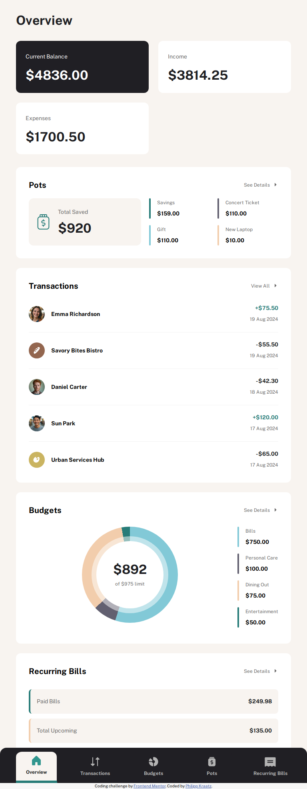
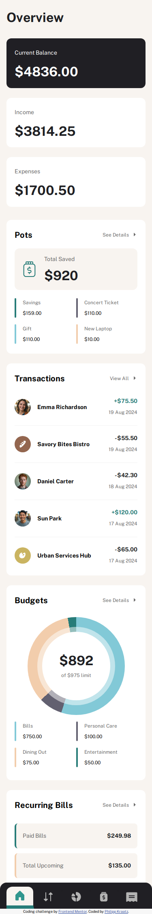
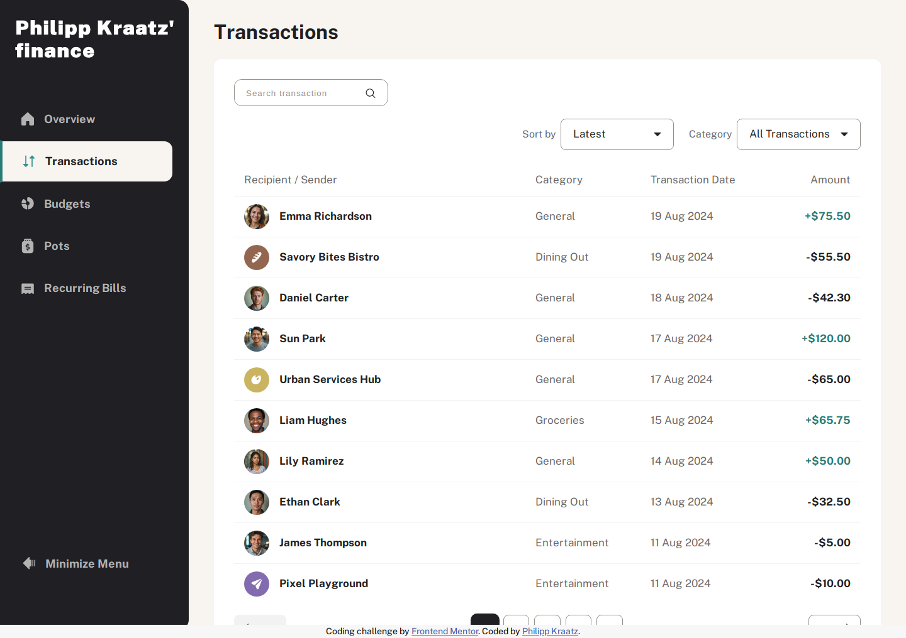
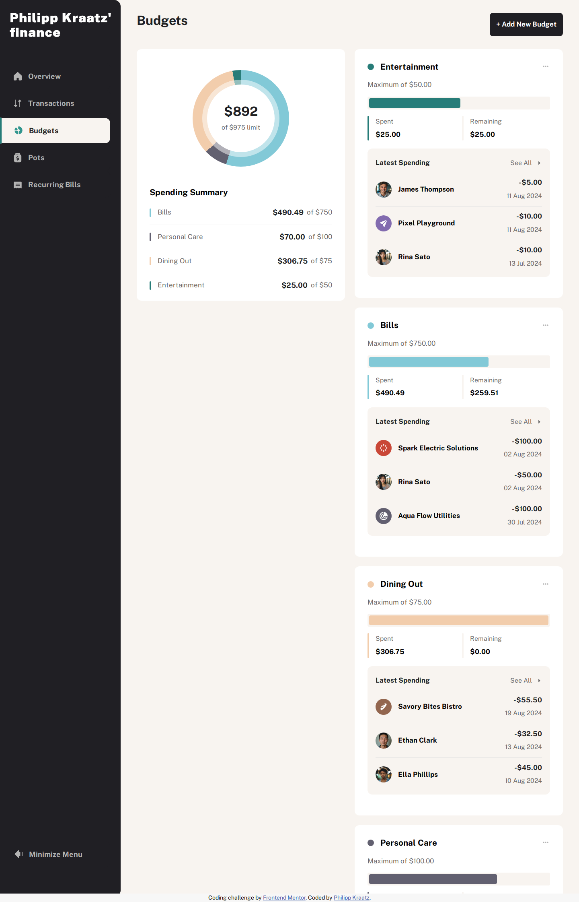
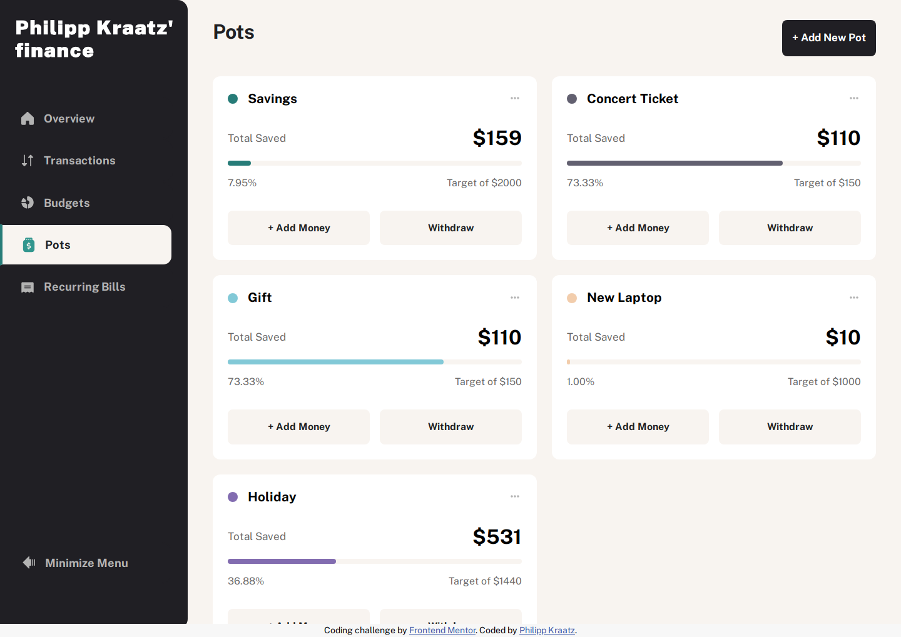
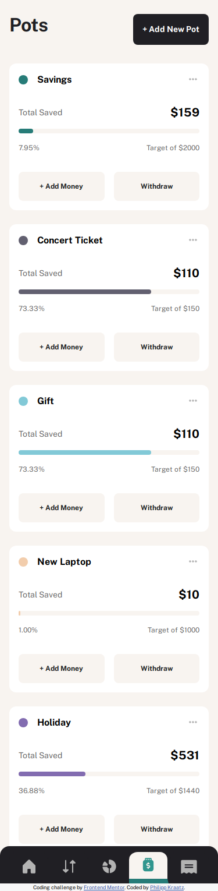
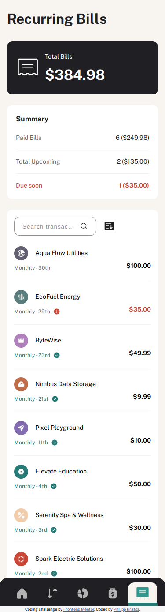

# Philipp Kraatz' finance - Personal Finance App

This is a solution to the [Personal finance app challenge on Frontend Mentor](https://www.frontendmentor.io/challenges/personal-finance-app-JfjtZgyMt1). Frontend Mentor provides challenges to build realistic projects.

- Live Site URL: [philippkraatz.com](https://philippkraatz.com)
- Solution URL: [GitHub](https://github.com/kephalosk/personal-finance-app)

## Table of contents

- [Project Structure](#project-structure)
- [Test Coverage](#test-coverage)
  - [Frontend](#frontend-build-0020250110_184110_fbf408e)
  - [Backend](#backend-build-0020250110_184110_fbf408e)
- [Overview](#overview)
    - [Screenshots - OverviewPage](#screenshots---overviewpage)
    - [Screenshots - TransactionsPage](#screenshots---transactionspage)
    - [Screenshots - BudgetsPage](#screenshots---budgetspage)
    - [Screenshots - PotsPage](#screenshots---potspage)
    - [Screenshots - BillsPage](#screenshots---billspage)
- [Technology Stack](#technology-stack)
- [Author](#author)

## Project Structure

The project is still in development. The current status is protocolled in ./project-documentation/project-structure:

## Test Coverage

### Frontend (build 0.0.20250110_184110_fbf408e)

### Backend (build 0.0.20250110_184110_fbf408e)

## Overview

### Screenshots - OverviewPage

Desktop

Tablet

Mobile

### Screenshots - TransactionsPage

Desktop

Tablet

Mobile

### Screenshots - BudgetsPage

Desktop

Tablet

Mobile

### Screenshots - PotsPage

Desktop

Tablet

Mobile

### Screenshots - BillsPage

Desktop

Tablet

Mobile

## My process

1. Make Refinements / Requirements Engineering

2. Setup Project

3. Create UI Components

4. Integrate UI Components

5. Create Backend Services

6. Create Frontend Services

7. Implement Business Logic

8. Create Deployment

9. Setup CI/CD

10. Implement Monitoring and Logging (TODO)

11. Add Authentication and Authorization  (TODO)

### Technology Stack

Frontend
- React/Typescript
- HTML
- SCSS
- Jest
- Playwright

Backend
- Nest.js
- TypeORM
- PostgreSQL
- Jest

Deployment
- Docker
- Kubernetes
- CI/CD with GitHub Actions

## Author

- Website - [Philipp Kraatz](https://philippkraatz.com)
- GitHub - [@kephalosk](https://github.com/kephalosk)
